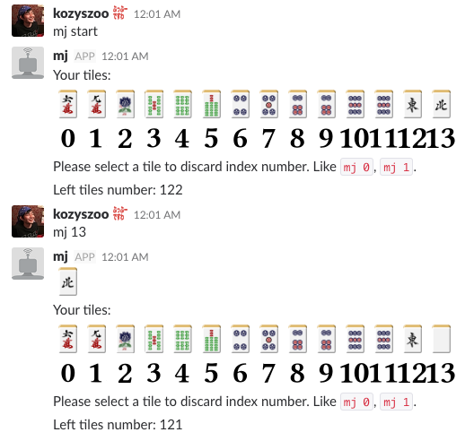

# What is this?
* Slack上で麻雀（もどき）を Play するためのチャットボットアプリケーション
* Chatbot として Ruboty を利用

# Requirment
* Ruby 2.3.0

# How to start chatbot

## リポジトリをクローン
```
$ git clone
$ cd mahjang_chatbot
```

## Slackグループの管理者権限でXMPPを有効にする
* https://hoge.slack.com/admin/settings#gateways で `Enable XMPP gateway (SSL only)` をチェック
* https://hoge.slack.com/account/gateways でUserとPassを取得

## Slack group の Token を取得して環境変数として設定

```
$ export SLACK_TOKEN=xoxb-XXXX....
```
https://api.slack.com/custom-integrations/legacy-tokens から取得できます

## Chatbot アプリケーションの起動
```
$ bundle install
$ bundle exec ruboty -l mahjang.rb
```

# How to play in Slack

アプリケーションを起動させたら、bot に対して メンション か DM を送ることで麻雀を始めることができます

例. bot名が `mj` の場合

```
@mj start # Start to play mahjang
@mj [number] # Discard tiles
```



# How to add emoji

麻雀牌の絵文字を slack に追加させるには下記2つのどちらかのツールをご利用ください。
また、麻雀牌の絵文字は http://sozai.7gates.net/docs/mahjong01/ から頂きました。

## 1. Emoji import tool の利用

```
$ bundle exec ruby import.rb
```

## 2. Slack Emoji Tools Add-on の利用

'Slack Emoji Tools' Add-on を使用すると、Drag&Drop でまとめて絵文字を追加可能
* https://chrome.google.com/webstore/detail/slack-emoji-tools/anchoacphlfbdomdlomnbbfhcmcdmjej

# Others

## コードドキュメントを参照する

```
$ bundle exec yardoc *.rb
$ open doc/index.html
```
